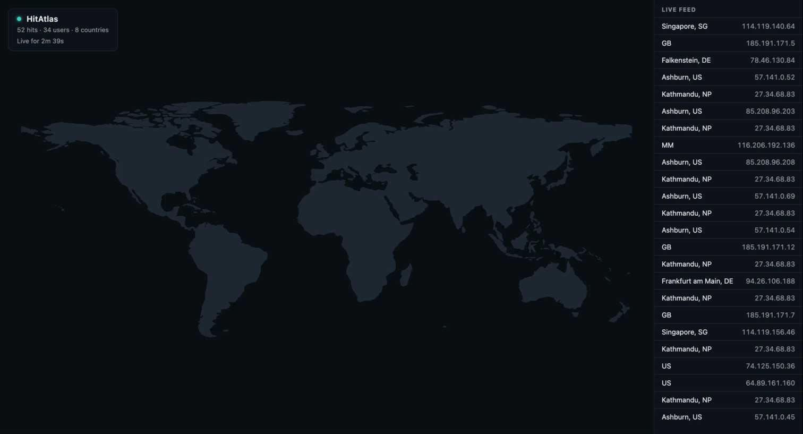

# HitAtlas

Tails your web server's access logs, resolves visitor IPs to a city, and shows them as live pings on a world map.



**<a href="https://hitatlas.onrender.com" target="_blank" rel="noopener">Live demo</a>** (fake random hits, hosted free
on Render, first load can take ~30-60s to wake up)

## How it works

- A Python backend tails Nginx/Apache/Caddy access logs, extracts visitor IPs, and looks up their city/country from a
  local database (no external API calls).
- Each hit is pushed to the browser in real time over Server-Sent Events.
- A static frontend renders those hits as animated pings on a 2D world map.

| Path          | What it is                                          |
|---------------|-----------------------------------------------------|
| `main.py`     | Entry point, wires everything together              |
| `config.py`   | Parses `config.toml`                                |
| `tailer.py`   | Follows log files, extracts and filters IPs         |
| `geo.py`      | IP → city/country/lat/lng lookup (MaxMind GeoLite2) |
| `sse.py`      | Broadcasts hits to connected browsers over SSE      |
| `demo.py`     | Generates fake random hits (`--demo` flag)          |
| `config.toml` | Which log file(s) to watch, and their format        |
| `frontend/`   | Static site: world map + live feed (no build step)  |

## Setup

Requires Python 3.10+.

1. **Install dependencies**
   ```
   python3 -m venv venv
   source venv/bin/activate
   pip install -r requirements.txt
   ```

2. **Get a GeoIP database.** Create a free account at https://www.maxmind.com/en/geolite2/signup, generate a license
   key, and download `GeoLite2-City.mmdb` into the project root (or point `HITATLAS_GEOIP_DB` at it).

3. **Configure `config.toml`** with the log file(s) to watch:
   ```toml
   [[source]]
   path = "/var/log/nginx/access.log"
   format = "nginx-combined"
   ```
   Or auto-discover every vhost on a shared server:
   ```toml
   [[source]]
   path_glob = "/home/*/logs/nginx/access.log"
   format = "nginx-combined"
   ```
   Supported `format` values: `nginx-combined`, `apache-combined`, `caddy-json`, or `custom_regex` (with a `regex` key
   using a named `ip` group).

4. **Run it**
   ```
   python3 main.py
   ```
   Or try it without any log files or GeoIP database, with fake random hits:
   ```
   python3 main.py --demo
   ```

5. **Open the frontend.** `frontend/` is a plain static site. `main.py` serves it itself on the same port as `/events`,
   so just open `http://<host>:8765/` (or put it behind a reverse proxy, see below).

## Running as a systemd service

```ini
[Unit]
Description=HitAtlas backend
After=network.target

[Service]
Type=simple
WorkingDirectory = /path/to/hitatlas
ExecStart = /path/to/hitatlas/venv/bin/python3 /path/to/hitatlas/main.py
Restart=always
RestartSec=3

[Install]
WantedBy=multi-user.target
```

```
systemctl daemon-reload
systemctl enable --now hitatlas
journalctl -u hitatlas -f
```

## Reverse-proxying `/events`

The backend listens on `127.0.0.1:8765` by default (plain HTTP, deliberately not exposed to the internet directly).
Point your reverse proxy at it, `proxy_buffering off` is required or the stream won't arrive in real time:

```nginx
location / {
    proxy_pass http://127.0.0.1:8765;
    proxy_http_version 1.1;
    proxy_set_header Connection "";
    proxy_buffering off;
    proxy_read_timeout 24h;
}
```

---

Feedback, contributions, and questions are always welcome, feel free to open an issue or pull request.
